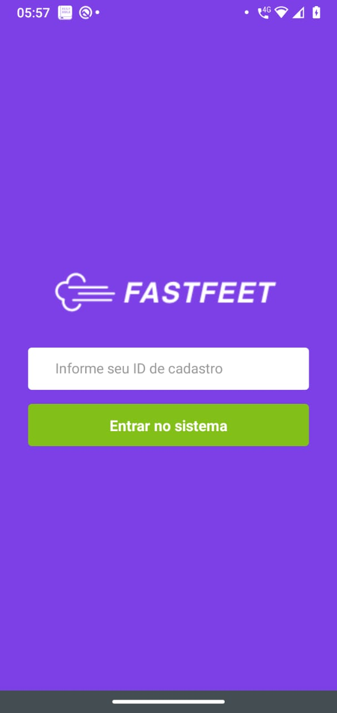
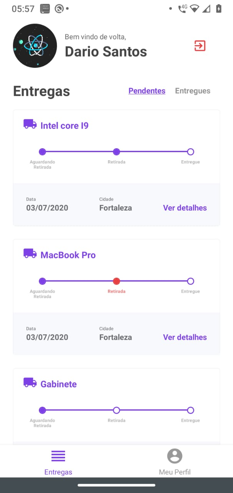
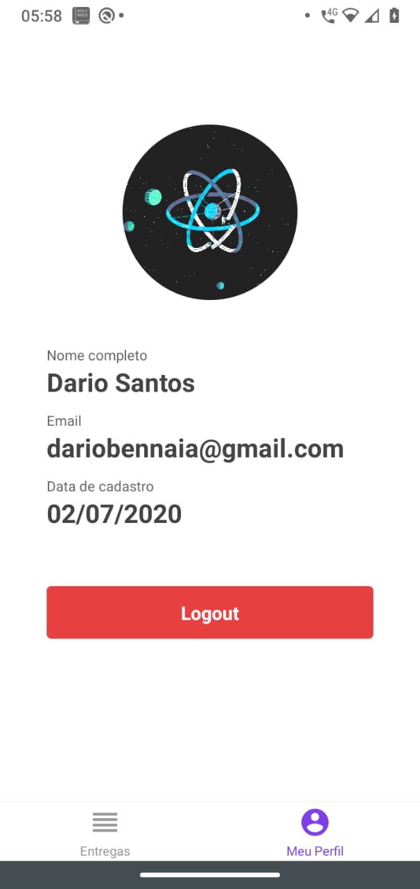
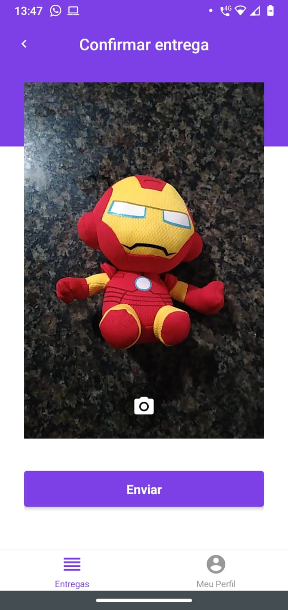
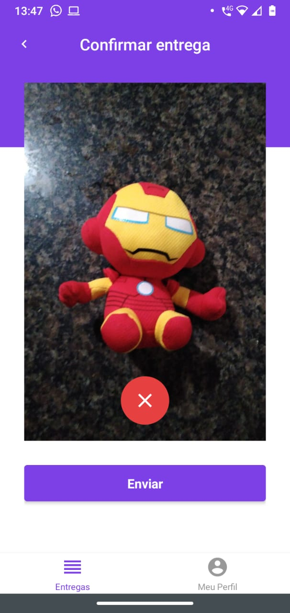

<h1 align="center">
  
</h1>

<p align="center">
  &nbsp;&nbsp;&nbsp;&nbsp;
  &nbsp;&nbsp;&nbsp;&nbsp;
  
</a>

<p align="center">
  <a href="#rocket-sobre">Sobre</a>&nbsp;&nbsp;&nbsp;|&nbsp;&nbsp;&nbsp;
  <a href="#camera-preview">Preview</a>&nbsp;&nbsp;&nbsp;|&nbsp;&nbsp;&nbsp;
  <a href="#pushpin-funcionalidades">Funcionalidades</a>&nbsp;&nbsp;&nbsp;|&nbsp;&nbsp;&nbsp;
  <a href="#hammer-tecnologias">Tecnologias</a>&nbsp;&nbsp;&nbsp;|&nbsp;&nbsp;&nbsp;
  <a href="#computer-como-usar">Como usar</a>&nbsp;&nbsp;&nbsp;
</p>

## :rocket: Sobre
Este é um projeto fictício feito para uma gestão de encomendas de uma transportadora chamada FastFeet.

Esta é a 3/3 partes de um projeto como todo. O mesmo foi construído utilizando as tecnlologias mais populares de JavaScript e do mercado.

Se você ainda não baixou as partes (1/3) ou (2/3), você vai encontrar elas abaixo, siga os passos para uma instalação correta:
- [(1/3) Api](https://github.com/dariobennaia/api-fastfeet)
- [(2/3) Web](https://github.com/dariobennaia/web-fastfeet)

## :camera: Preview

<p align="center">
  
  
  
  
</p>

<br />

<p align="center">
  
  
  
</p>

## :pushpin: Funcionalidades

Uma descrição resumida das funcionalidades presentes na aplicação.

### Autenticação
Funcionalidade responsável pelo gerenciamento de acesso ao App e todos os demais módulos a seguir.

### Gestão de entregas
O gerenciamento de encomendas se divide nas seguintes partes.

1. Listagem: Funcionalidade resposável por listar todas as encomendas atribuidas ao entregador.
2. Informação: Funcionalidade responsável por exibir as informações da encomenda.
3. Retirada da entrega: Funcionalidade responsavel por informar que uma encomenda foi retirada e está a caminho de entrega.
4. Confirmação de entrega: Funcionalidade responsavel por informa que uma encomenda foi entregue.

### Gestão de problemas
O gerenciamento de problemas se divide nas seguintes partes.

1. Cadastro: Funcionalidade resposável por registrar os problemas da entrega da encomenda.
2. Listagem: Funcionalidade responsável por listar todos os problemas de uma encomenda.


## :hammer: Tecnologias
Este Projeto foi desenvolvido usando as seguintes tecnologias:

-  [React Redux](https://github.com/reduxjs/redux)
-  [Redux](https://redux.js.org/)
-  [Redux Saga](https://redux-saga.js.org/)
-  [React Navigation 5](https://github.com/react-navigation/react-navigation)
-  [Styled Components](https://www.styled-components.com/)
-  [Axios](https://github.com/axios/axios)
-  [Immer](https://github.com/immerjs/immer)
-  [React Native Vector Icons](https://github.com/oblador/react-native-vector-icons)
-  [Date Fns](https://date-fns.org/)  
-  [Reactotron](https://infinite.red/reactotron)

## :computer: Como usar

Para instalar a aplicação você precisará executar os passos informados abaixo.

### Instalação básica

```bash
# Clone o repositório
$ git clone https://github.com/dariobennaia/mobile-fastfeet

# Entre na pasta do projeto
$ cd mobile-fastfeet

# Instale as dependências
$ yarn install

# Se for rodar no iOS, execute:
$ cd ios && pod install && cd ..

# Crie o arquivo .env com base no modelo .env.example e preencha suas informações corretamente.
$ cp .env.example .env

# Execute a aplicação Android
$ react-native run-android

## Execute a aplicação iOS
$ react-native run-ios
```

---
Feito com carinho por [Dário Santos](https://www.linkedin.com/in/dario-bennaia/) :purple_heart: :rocket:!